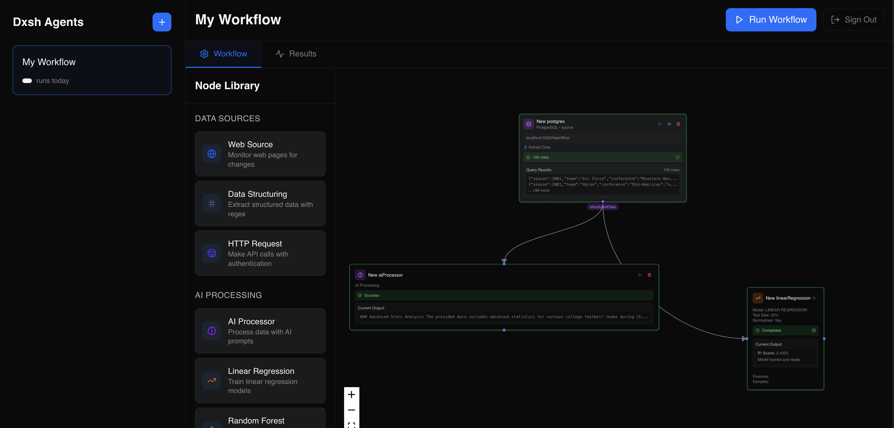
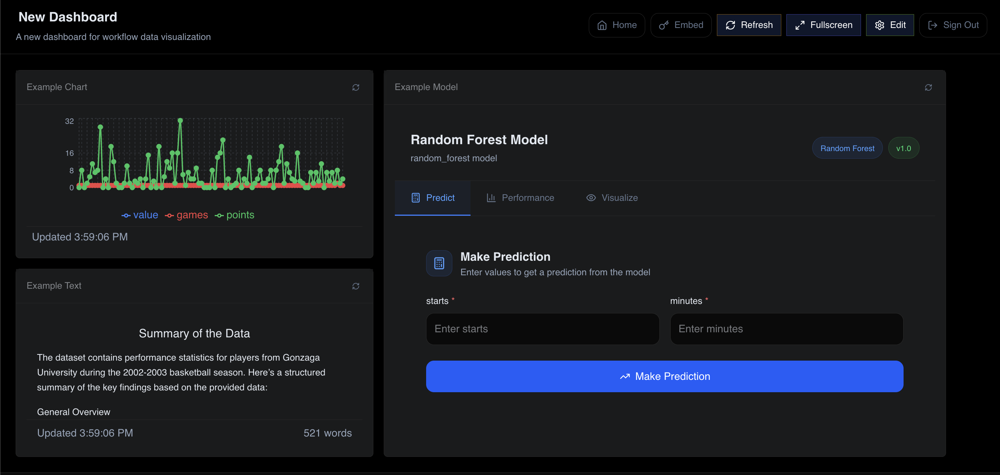
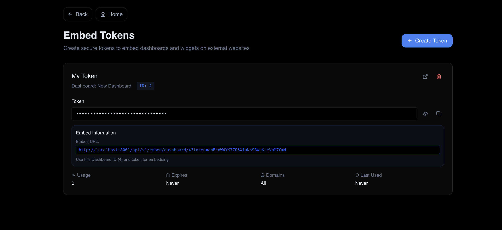

# Dxsh

A self-hostable visual workflow automation platform for data processing, analytics, and integration tasks.

[](https://discord.gg/m4g7suRu)

## Overview

Dxsh is a microservices-based platform that enables users to create, execute, and monitor data processing workflows through an intuitive visual interface. The system supports various data sources, processing nodes, and output destinations, making it suitable for ETL operations, data analytics, and automation tasks.

### Visual Workflow Builder



Build complex data pipelines with an intuitive drag-and-drop interface. Connect nodes, configure parameters, and execute workflows in real-time.

### Dashboard System



Create customizable dashboards with real-time data visualization. Share dashboards publicly or embed them in your applications.

### Embeddable Widgets



Generate secure embed tokens to share dashboards and widgets externally with fine-grained access control.

## Architecture

The platform consists of five core microservices:

### Services

1. **Workflow Engine** (Port 8000)

   - Core workflow execution engine
   - Handles workflow orchestration and node execution
   - Manages workflow state and execution history

2. **API Gateway** (Port 8001)

   - Central routing service for all API requests
   - Handles authentication and request forwarding
   - Provides unified API interface

3. **Dashboard Service** (Port 8002)

   - Manages dashboard configurations and widgets
   - Handles dashboard data aggregation
   - Provides embed token management

4. **Workflow Frontend** (Port 3000)

   - React-based workflow builder interface
   - Visual workflow design and configuration
   - Real-time workflow execution monitoring

5. **Dashboard Frontend** (Port 3001)
   - React-based dashboard visualization interface
   - Widget management and configuration
   - Embeddable dashboard and widget views

## Features

### Workflow Builder

- Visual drag-and-drop workflow design
- Extensive library of processing nodes
- Real-time execution monitoring
- Parameter configuration and validation
- Workflow templates and versioning

### Data Processing Nodes

- **Input Nodes**: HTTP requests, database queries, file uploads, web scraping
- **Processing Nodes**: Data transformation, filtering, aggregation, calculations
- **ML/AI Nodes**: GPT integration, text analysis, predictions
- **Output Nodes**: Database storage, file exports, API calls, notifications

### Dashboard System

- Customizable dashboard layouts
- Multiple widget types (charts, tables, metrics, text)
- Real-time data updates
- Embeddable dashboards and widgets
- Token-based public sharing

### Security Features

- JWT-based authentication
- Role-based access control
- API rate limiting
- Token-based embed authentication
- CORS configuration for embedding

## Quick Start

### Prerequisites

- Docker and Docker Compose
- Node.js 18+ (for local development)
- Python 3.9+ (for local development)
- PostgreSQL 13+ (or use Docker container)

### Docker Deployment

**⚠️ Docker deployment is currently not working due to build issues. Please use local development instead.**

### Local Development (Recommended)

1. Clone the repository:

```bash
git clone https://github.com/markm39/dxsh.git
cd dxsh
```

2. Run the development script:

```bash
./start-dev.sh
```

This will start all services locally. Access the applications at:

- Workflow Builder: http://localhost:3000
- Dashboard Interface: http://localhost:3001
- API Documentation: http://localhost:8001/docs

## Configuration

### Environment Variables

Each service requires specific environment variables. Key variables include:

- `DATABASE_URL`: PostgreSQL connection string
- `JWT_SECRET`: Secret key for JWT token generation
- `CORS_ORIGINS`: Allowed origins for CORS
- `API_BASE_URL`: Base URL for API services
- `FRONTEND_URL`: URL for frontend services

See individual service `.env.example` files for complete configuration options.

### Database Setup

The system uses PostgreSQL for data persistence. On first run, the database schema is automatically created through SQLAlchemy migrations.

For production deployments, ensure you:

1. Use a dedicated PostgreSQL instance
2. Configure proper backup strategies
3. Set secure database credentials
4. Enable SSL for database connections

## Usage

### Creating a Workflow

1. Access the Workflow Builder at http://localhost:3000
2. Click "New Workflow" to create a workflow
3. Drag nodes from the sidebar to the canvas
4. Connect nodes by dragging from output to input ports
5. Configure each node by clicking on it
6. Save and execute the workflow

### Building Dashboards

1. Access the Dashboard interface at http://localhost:3001
2. Create a new dashboard or edit existing ones
3. Add widgets and configure data sources
4. Arrange widgets using the grid layout
5. Save and share dashboards

### Embedding Dashboards

1. Navigate to Settings > Embed Tokens
2. Create a new embed token for a dashboard or widget
3. Configure security settings (domains, expiration)
4. Use the generated embed code in your application

Example embed code:

```html
<iframe
  src="http://localhost:3001/embed/dashboard/123?token=your-token-here"
  width="100%"
  height="600"
  frameborder="0"
>
</iframe>
```

## API Reference

### Authentication

All API endpoints require JWT authentication except public embed endpoints.

```bash
# Login
POST /api/v1/auth/login
{
  "username": "user@example.com",
  "password": "password"
}

# Returns
{
  "access_token": "jwt-token-here",
  "token_type": "bearer"
}
```

### Workflows

```bash
# List workflows
GET /api/v1/workflows

# Create workflow
POST /api/v1/workflows
{
  "name": "My Workflow",
  "description": "Process data",
  "nodes": [...],
  "connections": [...]
}

# Execute workflow
POST /api/v1/workflows/{id}/execute
```

### Dashboards

```bash
# List dashboards
GET /api/v1/dashboards

# Create dashboard
POST /api/v1/dashboards
{
  "name": "Analytics Dashboard",
  "description": "Main analytics",
  "layout": {...}
}

# Get dashboard data
GET /api/v1/dashboards/{id}/data
```

For complete API documentation, visit `/docs` on the API Gateway service.

## Development

### Adding New Nodes

See the [Node Development Guide](docs/development/creating-nodes.md) for instructions on creating custom workflow nodes.

### Creating Widgets

See the [Widget Development Guide](docs/development/creating-widgets.md) for instructions on building custom dashboard widgets.

### Testing

Run tests for each service:

```bash
# Backend services
cd services/workflow-engine
python -m pytest

# Frontend services
cd services/workflow-frontend
npm test
```

### Code Style

- Python: Follow PEP 8, use Black formatter
- TypeScript/React: Use ESLint and Prettier
- Commit messages: Follow conventional commits

## Deployment

### Production Considerations

1. **Security**

   - Use HTTPS for all services
   - Configure proper CORS policies
   - Rotate JWT secrets regularly
   - Implement rate limiting

2. **Performance**

   - Use Redis for caching
   - Configure database connection pooling
   - Implement horizontal scaling for services
   - Use CDN for static assets

3. **Monitoring**
   - Set up logging aggregation
   - Configure health checks
   - Implement metrics collection
   - Set up alerting

### Scaling

Each microservice can be scaled independently:

```bash
docker-compose -f docker-compose.microservices.yml up -d --scale workflow-engine=3
```

## Troubleshooting

### Common Issues

1. **Database Connection Errors**

   - Verify PostgreSQL is running
   - Check DATABASE_URL configuration
   - Ensure database exists

2. **CORS Errors**

   - Update CORS_ORIGINS in API Gateway
   - Verify frontend URLs are correct

3. **Authentication Failures**
   - Check JWT_SECRET matches across services
   - Verify token expiration settings

See the [Troubleshooting Guide](docs/troubleshooting.md) for more solutions.

## Contributing

1. Fork the repository
2. Create a feature branch
3. Make your changes
4. Add tests for new functionality
5. Submit a pull request

See [CONTRIBUTING.md](CONTRIBUTING.md) for detailed guidelines.

## License

This project is licensed under the MIT License. See [LICENSE](LICENSE) file for details.

## Support

- Documentation: [docs/](docs/)
- Issues: GitHub Issues
- Discussions: GitHub Discussions
