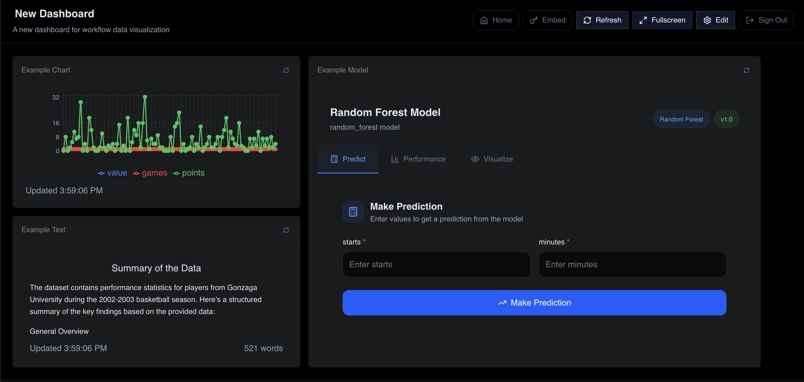

# Dxsh Features Guide

This guide provides a comprehensive overview of all features available in the Dxsh platform.

## Table of Contents

1. [Workflow Builder](#workflow-builder)
2. [Dashboard System](#dashboard-system)
3. [Data Processing](#data-processing)
4. [Authentication & Security](#authentication--security)
5. [API Integration](#api-integration)

## Getting Started

### Login Screen

*Screenshot needed: Capture the login screen at http://localhost:3001 showing the Dxsh branding, email/password fields, and the "Sign in to your account" button.*

### Main Navigation

*Screenshot needed: After logging in, capture the main dashboard view showing the sidebar navigation with Dashboard and Workflow options.*

## Workflow Builder

### Visual Workflow Design

The workflow builder provides an intuitive drag-and-drop interface for creating data processing workflows.

*Screenshot needed: Go to http://localhost:3002 and capture the entire workflow builder interface showing:
- Left sidebar with node library
- Center canvas area
- Top header with "Run Workflow" button
- Agent selection sidebar on the left*

**Key Features:**

- Real-time workflow visualization
- Node library with categories
- Connection validation
- Zoom and pan controls
- Grid snapping for alignment

### Creating Your First Workflow

*Screenshot needed: Show the empty workflow canvas with the "No workflow nodes yet" message and "Drag nodes from the library to build your workflow" text.*

**How to Use:**

1. Access the Workflow Builder at http://localhost:3002
2. Select or create an agent from the left sidebar
3. Drag nodes from the node library onto the canvas
4. Connect nodes by dragging from output to input ports
5. Click nodes to configure parameters
6. Save and execute workflows

*Screenshot needed: Capture a close-up of the node library sidebar showing all available node categories:
- Data Sources
- Data Processing
- ML Models
- Output*

### Node Categories

#### Input Nodes

*Screenshot needed: Create a workflow with examples of each input node type (Web Source, HTTP Request, File Node, PostgreSQL) connected together.*

- **Web Source**: Extract data from websites with visual selector
- **HTTP Request**: Make API calls to external services
- **PostgreSQL**: Execute SQL queries
- **File Node**: Process uploaded CSV/JSON files

##### Web Source Configuration

*Screenshot needed: Open the Web Source configuration modal showing:
- URL input field
- Visual selector preview
- Extracted data preview
- Scraping configuration options*

##### HTTP Request Configuration

*Screenshot needed: Open the HTTP Request configuration showing:
- Method selection (GET/POST/PUT/DELETE)
- URL field
- Headers section
- Body editor
- Authentication options*

#### Processing Nodes

- **Data Structuring**: Transform and reshape data
- **AI Processor**: Natural language processing with GPT

##### AI Processor Configuration

*Screenshot needed: Open the AI Processor configuration showing:
- Prompt template editor
- Model selection
- Token limits
- Output format options*

#### ML/AI Nodes

*Screenshot needed: Create a workflow showing Linear Regression and Random Forest nodes connected to a data source.*

- **Linear Regression**: Statistical modeling and predictions
- **Random Forest**: Advanced ML predictions

##### Linear Regression Setup

*Screenshot needed: Open Linear Regression configuration showing:
- Feature selection
- Target variable selection
- Training options
- Model metrics display*

#### Output Nodes

- **Chart Generator**: Create visualizations
- **PostgreSQL**: Save data to database
- **File Node**: Export to CSV, JSON
- **Dashboard Connector**: Send data to dashboards

### Workflow Execution

*Screenshot needed: Capture a workflow during execution showing:
- Running workflow with progress indicators on nodes
- "Running..." button state
- Node execution status (green for success, yellow for running)*

**Execution Modes:**

- **Manual**: Run workflows on-demand via "Run Workflow" button
- **Scheduled**: Set up recurring executions (Coming soon)
- **Triggered**: Start via API or webhook (Coming soon)

### Workflow Results

*Screenshot needed: Click on the "Results" tab and capture the results view showing:
- Executed nodes with their results
- Data preview for each node
- Execution timestamps
- Any charts or visualizations generated*

**Monitoring Features:**

- Real-time execution progress
- Node status indicators
- Error highlighting
- Execution history
- Result data preview

## Dashboard System

### Dashboard Creation

*Screenshot needed: Navigate to http://localhost:3001 after login and capture the main dashboard interface showing:
- Top navigation bar with Dxsh branding
- Dashboard grid layout
- Add Widget button
- Dashboard selection dropdown*

Create interactive dashboards to visualize workflow results and monitor metrics.

**Features:**

- Drag-and-drop widget placement
- Responsive grid layout
- Multiple dashboard support
- Access control
- Auto-refresh capabilities

### Creating Widgets

*Screenshot needed: Click "Add Widget" button and capture the modal showing:
- Widget type selection
- Widget configuration options
- Data source selection*

### Widget Types

#### Chart Widget

*Screenshot needed: Create a chart widget showing:
- A line or bar chart with sample data
- Chart title and configuration
- The widget in the dashboard grid*

*Screenshot needed: Open chart widget configuration showing:
- Chart type selection (Line, Bar, Pie)
- Data mapping options
- Styling options
- Title and description fields*

#### Text Widget

*Screenshot needed: Create a text widget showing:
- Rich text content
- Markdown formatting
- The widget integrated in the dashboard*

### Dashboard Sharing

*Screenshot needed: Navigate to the Embed Tokens page (http://localhost:3001/embed-tokens) showing:
- Create Token button
- List of existing tokens
- Token management options*

#### Creating Embed Tokens

*Screenshot needed: Click "Create Token" and capture the modal showing:
- Token name field
- Resource type selection (Dashboard/Widget)
- Resource ID selection
- Expiration options
- Domain restrictions field*

**Embed Token Management:**

- Create tokens with expiration
- Domain restrictions for security
- Copy embed code snippets
- Revoke access anytime

### Embedded Dashboard Example

*Screenshot needed: Open the embed-test.html file in a browser and show:
- An embedded dashboard in an iframe
- The embed configuration interface
- A successfully loaded dashboard*

## Data Processing

### Data Sources

**Supported Inputs:**

- REST APIs (GET, POST, PUT, DELETE)
- GraphQL endpoints
- SQL databases (PostgreSQL, MySQL)
- CSV, JSON, Excel files
- Web pages (via scraping)
- Real-time streams (Coming soon)

### Data Quality

**Validation Features:**

- Schema validation
- Data type checking
- Required field validation
- Custom validation rules
- Error handling and logging
