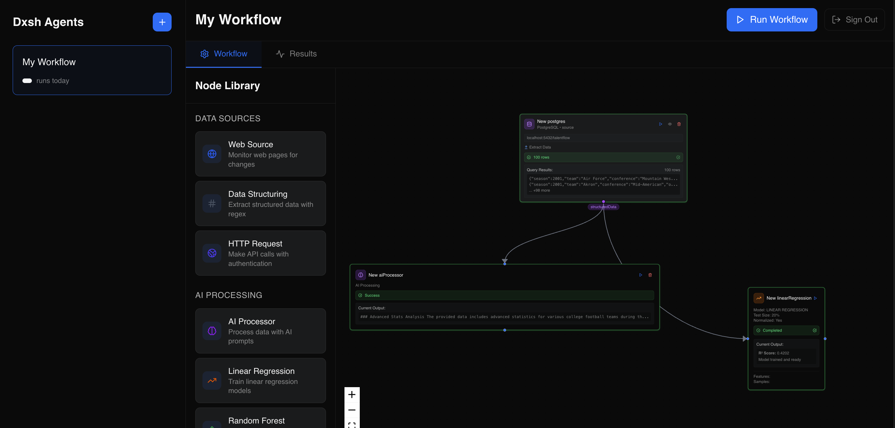

# Dxsh Features Guide

This guide provides a comprehensive overview of all features available in the Dxsh platform.

## Table of Contents

1. [Workflow Builder](#workflow-builder)
2. [Dashboard System](#dashboard-system)
3. [Data Processing](#data-processing)
4. [Authentication & Security](#authentication--security)
5. [API Integration](#api-integration)

## Getting Started

### Login Screen

### Main Navigation

After logging in, you'll see the main dashboard view with sidebar navigation including Dashboard and Workflow options.

## Workflow Builder

### Visual Workflow Design

The workflow builder provides an intuitive drag-and-drop interface for creating data processing workflows.

**Key Features:**

- Real-time workflow visualization
- Node library with categories
- Connection validation
- Zoom and pan controls
- Grid snapping for alignment

### Creating Your First Workflow

**How to Use:**

1. Access the Workflow Builder at http://localhost:3000
2. Select or create an agent from the left sidebar
3. Drag nodes from the node library onto the canvas
4. Connect nodes by dragging from output to input ports
5. Click nodes to configure parameters
6. Save and execute workflows

### Node Categories

#### Input Nodes

- **Web Source**: Extract data from websites with visual selector
- **HTTP Request**: Make API calls to external services
- **PostgreSQL**: Execute SQL queries
- **File Node**: Process uploaded CSV/JSON files

##### Web Source Configuration

##### HTTP Request Configuration

The HTTP Request node allows you to configure:

- Method selection (GET/POST/PUT/DELETE)
- URL field
- Headers section
- Body editor
- Authentication options

#### Processing Nodes

- **Data Structuring**: Transform and reshape data
- **AI Processor**: Natural language processing with GPT

##### AI Processor Configuration

The AI Processor configuration includes:

- Prompt template editor
- Model selection
- Token limits
- Output format options

#### ML/AI Nodes

- **Linear Regression**: Statistical modeling and predictions
- **Random Forest**: Advanced ML predictions

##### Linear Regression Setup

The Linear Regression configuration includes:

- Feature selection
- Target variable selection
- Training options
- Model metrics display

#### Output Nodes

- **Chart Generator**: Create visualizations
- **PostgreSQL**: Save data to database
- **File Node**: Export to CSV, JSON
- **Dashboard Connector**: Send data to dashboards

### Workflow Execution

During workflow execution you'll see:

- Running workflow with progress indicators on nodes
- "Running..." button state
- Node execution status (green for success, yellow for running)

**Execution Modes:**

- **Manual**: Run workflows on-demand via "Run Workflow" button
- **Scheduled**: Set up recurring executions (Coming soon)
- **Triggered**: Start via API or webhook (Coming soon)

### Workflow Results

**Monitoring Features:**

- Real-time execution progress
- Node status indicators
- Error highlighting
- Execution history
- Result data preview

## Dashboard System

### Dashboard Creation

Create interactive dashboards to visualize workflow results and monitor metrics.

**Features:**

- Drag-and-drop widget placement
- Responsive grid layout
- Multiple dashboard support
- Access control
- Auto-refresh capabilities

### Creating Widgets

When you click the "Add Widget" button, you'll see:

- Widget type selection
- Widget configuration options
- Data source selection

### Widget Types

#### Chart Widget

The chart widget configuration includes:

- Chart type selection (Line, Bar, Pie)
- Data mapping options
- Styling options
- Title and description fields

#### Text Widget

Text widgets support:

- Rich text content
- Markdown formatting
- Integration in the dashboard grid

### Dashboard Sharing

#### Creating Embed Tokens

When creating embed tokens, you can configure:

- Token name field
- Resource type selection (Dashboard/Widget)
- Resource ID selection
- Expiration options
- Domain restrictions field

**Embed Token Management:**

- Create tokens with expiration
- Domain restrictions for security
- Copy embed code snippets
- Revoke access anytime

### Embedded Dashboard Example

## Data Processing

### Data Sources

**Supported Inputs:**

- REST APIs (GET, POST, PUT, DELETE)
- GraphQL endpoints
- SQL databases (PostgreSQL, MySQL)
- CSV, JSON, Excel files
- Web pages (via scraping)
- Real-time streams (Coming soon)

### Data Quality

**Validation Features:**

- Schema validation
- Data type checking
- Required field validation
- Custom validation rules
- Error handling and logging
